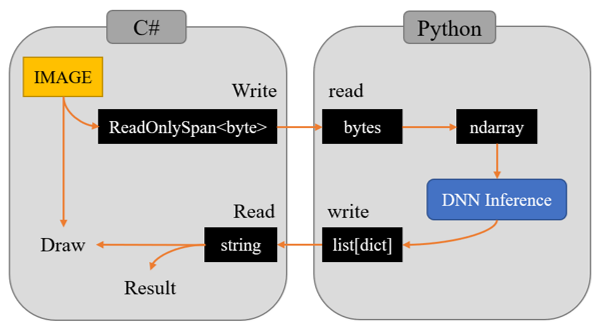

# Pype

### Environments
* Windows 10
* .NET 7
* Python 3.10

### Data flow

**Py**thonとpi**pe**で通信するためのリポジトリです。  
Windows限定であることに注意してください。  
また，PythonをDNNの推論モジュールにするために作ったので抽象度は低いです。  
これをベースに自分でいろいろ書き換えてみてください。  

Windowsの名前付きパイプ通信は同一ホスト内では一種の共有メモリとして振る舞います。  
mmapと違い実ファイルを用意しなくても良いというメリットもあります。  
Pythonは子プロセスで，単純な関数のように振る舞います。  

This is a repository for communicating with **Py**thon via named pi**pe**.  
Note that this is Windows-only.  
Also, the level of abstraction is low because it was created to use Python as an inference module for DNN.  
Please rewrite it yourself based on this.  

Named pipe communication in Windows behaves as a kind of shared memory within the same host.  
Unlike mmap, there is no need to prepare real files on your hardware disk.  
Python is a child process and behaves like a simple function.  
